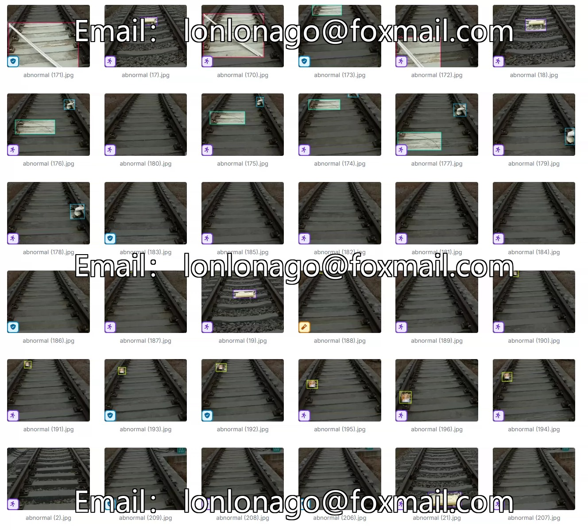
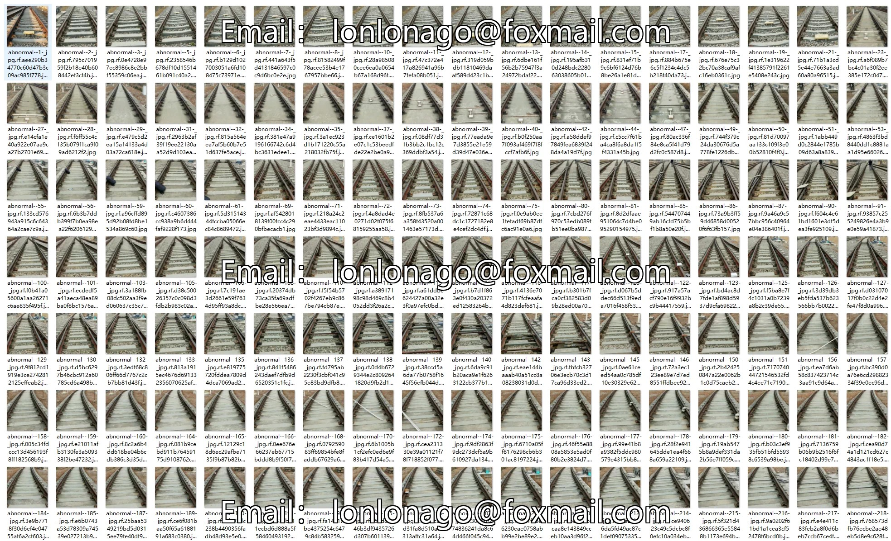
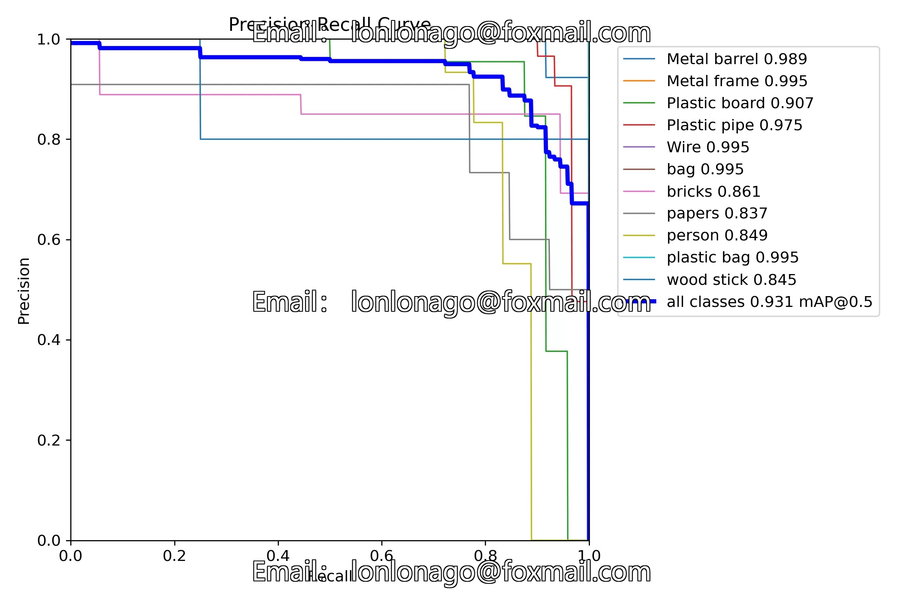
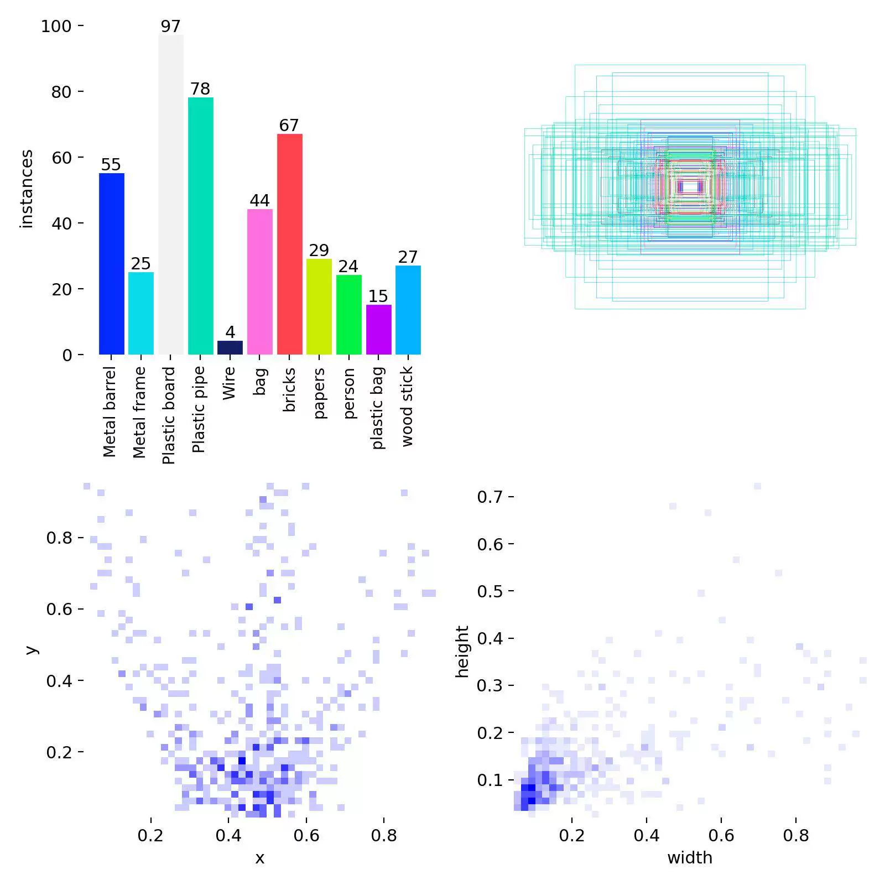
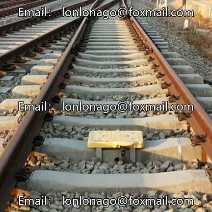
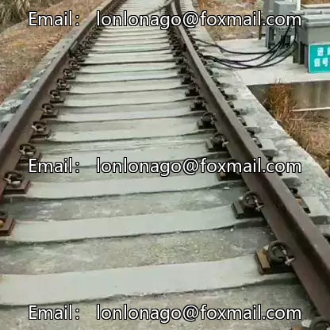
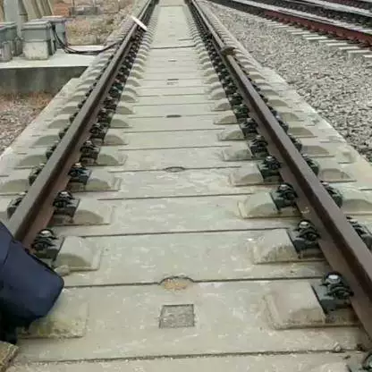

## Body

The railway track detection dataset in YOLO format consists of 572 images, labeled and divided into training set (401 images), test set (57 images), and validation set (114 images). It is divided into 11 categories: 'Metal barrel', 'Metal frame', 'Plastic board', 'Plastic pipe', 'Wire', 'bag', 'bricks', 'papers', 'person', 'plastic bag', 'wood stick'.

"Metal barrel", "Metal frame", "Plastic board", "Plastic pipe", "Wire", "bag", "bricks", "papers", "person", "plastic bag", "wood stick"

YOLOv8 weight file (Training rounds 100, pre-trained model YOLOv8s.pt, mAP@50 0.931)
YOLOv11 weight file (Training rounds 100, pre-trained model YOLO11m.pt, mAP@50 0.953)

Electronic virtual products are not returnable upon sale.

## Images

Here is a pay link on Stripe ( https://buy.stripe.com/3cs8yP7sY87d0vu9AB ). Please contact me lonlonago@foxmail.com after funding $89, and I will send you a complete data files , thank you!

